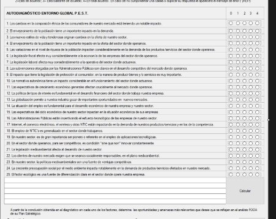
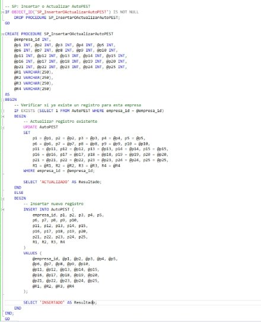
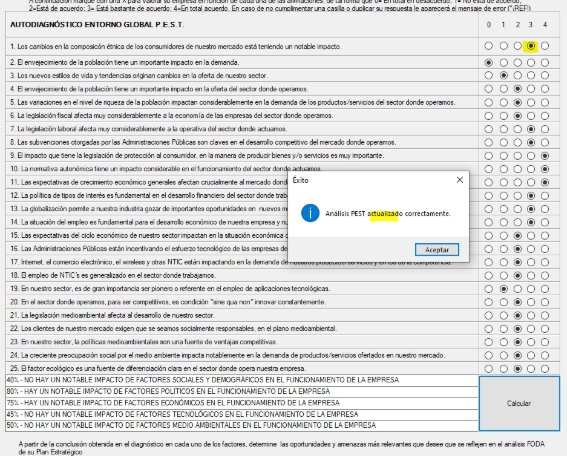
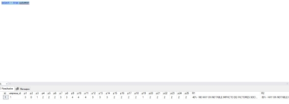
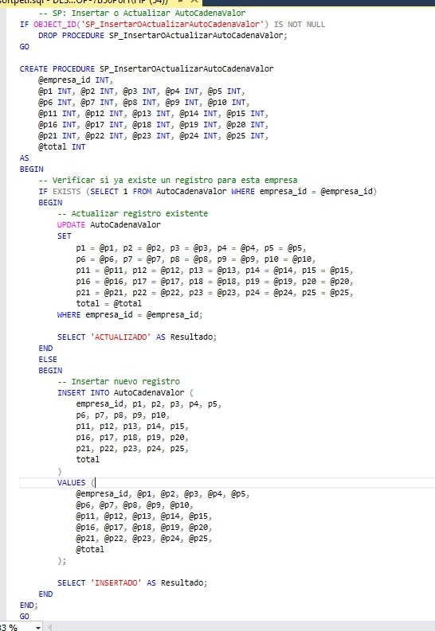
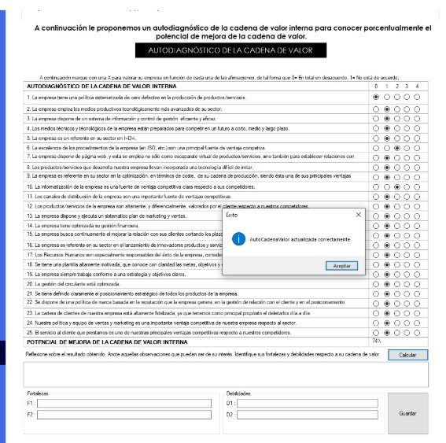
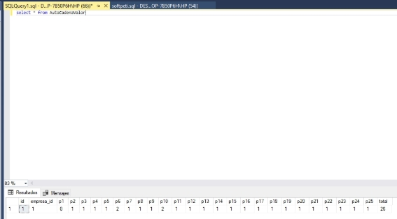

\# Examen Práctica Unidad II - PETI Estudiante: Jerson Roni Chambi Cori 

Fecha: 28/05/25 

Repositorio: https://github.com/JersonCh/PE\_II\_EXAMEN\_PRACTICO Descripción del Proyecto 

1. Autodiagnóstico PEST - Registro en Base de Datos 

Se modificó el código del análisis PEST para permitir el registro y actualización de datos en la base de datos: 

Funcionalidad de Registro: Primera ejecución crea un nuevo registro en la base de datos 

Funcionalidad de Actualización: Ediciones posteriores actualizan el registro existente sin crear duplicados 

Procedimiento Almacenado: Se creó un stored procedure específico para manejar las operaciones de inserción y actualización del test PEST 

Características principales: 

Validación de registros existentes 

Actualización automática en lugar de crear nuevos registros Manejo eficiente de datos mediante procedimientos almacenados 

2. Autocadena de Valor - Integración con Base de Datos Similar implementación para el test de Autocadena de Valor: 

   Persistencia de Datos: Los valores del test se guardan correctamente en la base de datos 

   Procedimiento Almacenado Dedicado: Creación del procedimiento para operaciones CRUD 

   Código Modificado: Adaptación del código existente para integración con la base de datos 

   **Capturas del Sistema Autodiagnóstico PEST** Interfaz inicial del autodiagnóstico PEST 

Proceso de registro de datos en el formulario PEST 

![ref1]

Verificación de que los datos se registran correctamente sin duplicar registros 

![ref2]

Procedimiento almacenado creado para el manejo de datos PEST 

Funcionalidad de Actualización 

Confirmación de que los cambios se actualizan correctamente 

Conclusiones 

Las mejoras implementadas han logrado transformar el sistema de autodiagnóstico de una herramienta de cálculo temporal a una solución robusta con persistencia de datos, permitiendo un mejor seguimiento y análisis de los resultados empresariales a lo largo del tiempo. 

**Capturas del Sistema Autodiagnóstico Cadena de Valor** 

- **Procedimiento almacenado utilizado** 

- Luego de completar los datos dos veces se actualiza o guarda la informacion. 

- Comprobacion de que lso datos se guardaron 

[ref1]: Aspose.Words.062e3bda-e4e2-49b0-ba31-15cfc10003f3.002.jpeg
[ref2]: Aspose.Words.062e3bda-e4e2-49b0-ba31-15cfc10003f3.003.jpeg
